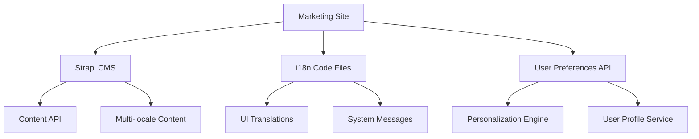
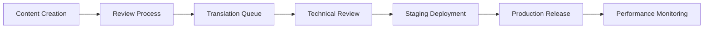

# HeliconTrade: Content Management & Personalization Strategy

## Executive Summary

This document outlines the strategic approach for managing content, user personalization, and internationalization (i18n) in the HeliconTrade ecosystem. It defines clear boundaries between what should be managed through Strapi CMS versus code-based solutions, ensuring optimal performance, maintainability, and user experience.

---

## 1. Content Management Strategy (Strapi CMS)

### ✅ What SHOULD Live in Strapi CMS

#### **Marketing Content**
- **Features & Platform Capabilities** ✅ *Already Integrated*
  - Feature descriptions, benefits, and categorization
  - Beta/Coming Soon flags for roadmap communication
  - Icon and visual representation metadata

- **News & Company Updates** ✅ *Already Integrated* 
  - Press releases, company announcements
  - Market analysis and commentary
  - Product update notifications
  - Industry insights

- **Blog & Educational Content** ✅ *Already Integrated*
  - Trading guides and tutorials
  - Market analysis articles
  - Educational resources
  - Expert insights and commentary

#### **Dynamic Homepage Content** 🚧 *Priority Next*
- **Hero Section Content**
  - Main value propositions
  - Call-to-action text and messaging
  - Feature highlights rotation

- **Platform Statistics**
  - Real-time metrics display values
  - Achievement milestones
  - Performance indicators


#### **Legal & Compliance** 🔄 *Recommended*
- Privacy Policy updates
- Terms of Service changes
- Cookie Policy modifications
- Regulatory compliance notices

#### **SEO & Marketing Pages** 🔄 *Recommended*
- Landing page content for campaigns
- A/B test variations
- Seasonal messaging
- Geographic content variations

### ❌ What Should NOT Live in Strapi CMS

#### **User Interface & System Content**
- Navigation labels and menu items
- Form labels and validation messages
- Button text and microcopy
- System notifications and alerts

#### **User-Specific Data**
- Trading preferences and settings
- Portfolio configurations
- Personal alerts and notifications
- Account-specific content

#### **Real-Time Data**
- Market prices and data feeds
- Live trading information
- User authentication states
- Dynamic calculations

---

## 2. User Personalization Strategy

### 🎯 Personalization Boundaries

#### **Client-Side Personalization** (Keep in App)
- **Trading Interface Customization**
  - Dashboard layout preferences
  - Chart configurations and templates
  - Watchlist organizations
  - Alert frequency and delivery preferences

- **User Experience Preferences**
  - Theme selection (dark/light mode)
  - Language preferences
  - Notification settings
  - Display density options

- **Performance-Critical Personalization**
  - Recently viewed symbols/markets
  - Quick access shortcuts
  - Session-based preferences
  - Cache-optimized data

#### **CMS-Driven Content Personalization** (Limited Use)
- **Geographic Content Variations**
  - Region-specific regulatory notices
  - Market-specific educational content
  - Localized success stories

- **User Segment Marketing**
  - Beginner vs. advanced trader content
  - Different onboarding flows
  - Segment-specific feature highlights

### ⚡ Performance Considerations

```
Marketing Site Performance Targets:
- Initial page load: < 2 seconds
- Time to Interactive: < 3 seconds
- Content updates: Real-time via API
- Cache invalidation: Automated on content changes
```

---

## 3. Internationalization (i18n) Strategy

### 🌐 Recommended Approach: Hybrid Model

#### **Code-Based i18n** (Primary Approach)
```
/locales/
├── en.json          # English (default)
├── fr.json          # French
├── es.json          # Spanish
├── de.json          # German
├── ja.json          # Japanese
└── ar.json          # Arabic
```

**Benefits:**
- ⚡ Faster initial load times
- 🔒 Type safety and validation
- 🚀 Better developer experience
- 📦 Bundled with application code

#### **CMS-Based i18n** (Content-Specific)
```
Strapi Multi-locale Support for:
├── Marketing content
├── Blog articles
├── News updates
├── Legal documents
└── Educational resources
```

**Implementation:**
```javascript
// Example: Mixed approach
const { t } = useI18n()                    // Code-based UI strings
const content = await getLocalizedContent() // CMS-based content

// UI Elements (fast, cached)
const buttonText = t('buttons.get_started')

// Content (dynamic, multi-locale)
const features = await getFeatures(locale)
```

### 🎯 Language Priority Rollout

**Phase 1: Foundation** 
- ✅ English (Default)
- 🔄 French (EU Market)
- 🔄 Spanish (LatAm Market)

**Phase 2: Expansion**
- German (DACH Region)
- Japanese (Asian Markets)
- Arabic (Middle East)

**Phase 3: Growth Markets**
- Portuguese (Brazil)
- Italian (Southern Europe)
- Korean (Asia Pacific)

---

## 4. Technical Architecture

### 🏗️ Implementation Strategy



#### **Content Delivery Flow**
1. **Static Content** → Build-time embedding (i18n files)
2. **Dynamic Content** → Runtime API calls (Strapi)
3. **User Preferences** → Client-side storage + API sync
4. **Real-time Data** → WebSocket/API streams

### 📊 Performance Monitoring

```javascript
// Key Metrics to Track
const performanceMetrics = {
  contentLoadTime: 'Time to load CMS content',
  translationCoverage: 'Percentage of translated strings',
  cacheHitRatio: 'CMS content cache effectiveness',
  userEngagement: 'Content interaction rates'
}
```

---

## 5. Content Workflows & Governance

### 👥 Roles & Responsibilities

#### **Marketing Team**
- ✅ Create and manage marketing content
- ✅ Update feature descriptions and benefits
- ✅ Manage blog and news content
- ✅ A/B testing content variations

#### **Product Team** 
- ✅ Feature roadmap and Coming Soon flags
- ✅ Product announcements and updates
- ✅ Technical content review
- ❌ UI/UX text and system messages

#### **Development Team**
- ✅ UI/UX translations and system messages
- ✅ Technical content integration
- ✅ Performance optimization
- ❌ Marketing content creation

#### **Legal/Compliance Team**
- ✅ Legal document updates
- ✅ Regulatory compliance content
- ✅ Privacy and terms management
- ❌ Marketing messaging

### 🔄 Content Publishing Workflow



---

## 6. Migration & Implementation Roadmap

### 🎯 Phase 1: Foundation (Completed ✅)
- [x] News content type and integration
- [x] Features content type and dynamic homepage
- [x] Blog content management
- [x] Basic API integration

### 🚧 Phase 2: Enhancement (Next 4-6 weeks)
- [ ] Homepage hero and statistics management
- [ ] Legal document management
- [ ] SEO metadata and structured data
- [ ] Performance monitoring dashboard

### 🔄 Phase 3: Localization (6-8 weeks)
- [ ] Multi-language UI implementation
- [ ] CMS content localization setup
- [ ] Translation workflow establishment
- [ ] Regional content variations

### 🚀 Phase 4: Optimization (8-12 weeks)
- [ ] Advanced caching strategies
- [ ] Content performance monitoring
- [ ] A/B testing framework
- [ ] Analytics and insights dashboard

---

## 7. Success Metrics & KPIs

### 📈 Performance Metrics
```
Content Management Efficiency:
- Content update frequency: 2-3x per week
- Time to publish: < 30 minutes
- Translation turnaround: < 48 hours

User Experience Impact:
- Page load speed: < 2 seconds
- Content engagement: +25% time on page
- Bounce rate reduction: -15%

Development Productivity:
- Feature deployment speed: +40%
- Content-related bugs: -60%
- Developer satisfaction: High
```

### 🎯 Business Impact Goals
- **Faster Market Response:** Reduce content update time from days to hours
- **Global Reach:** Support 6+ languages by end of year
- **Better User Experience:** Personalized content based on user segments
- **Development Efficiency:** Reduce content-related development overhead by 50%

---

## 8. Risk Mitigation

### ⚠️ Identified Risks & Solutions

#### **Performance Risks**
- **Risk:** CMS API calls slowing page load
- **Solution:** Implement intelligent caching and fallback strategies
- **Monitoring:** Real-time performance alerts

#### **Content Quality Risks**
- **Risk:** Inconsistent content across languages
- **Solution:** Centralized content review and approval workflow
- **Monitoring:** Content audit tools and regular reviews

#### **Technical Risks**
- **Risk:** CMS downtime affecting marketing site
- **Solution:** Static content fallbacks and redundancy
- **Monitoring:** Uptime monitoring and automated alerts

---

## 9. Conclusion & Next Steps

### 🎯 Immediate Actions (Next 2 weeks)
1. **Implement homepage hero content management** in Strapi
2. **Create content performance monitoring** dashboard
3. **Establish content review workflow** for team
4. **Set up legal document management** system

### 🔄 Medium-term Goals (Next 2 months)  
1. **Deploy multi-language UI** framework
2. **Integrate legal document management** 
3. **Launch A/B testing** for key marketing pages
4. **Implement advanced caching** strategies

### 🚀 Long-term Vision (6+ months)
- **Fully localized platform** supporting global markets
- **AI-driven content personalization** based on user behavior
- **Real-time content optimization** using performance data
- **Seamless content workflows** for all stakeholders

---

*This strategy document should be reviewed quarterly and updated based on platform growth, user feedback, and technical capabilities.*

**Document Version:** 1.0  
**Last Updated:** September 20, 2024  
**Next Review:** December 20, 2024